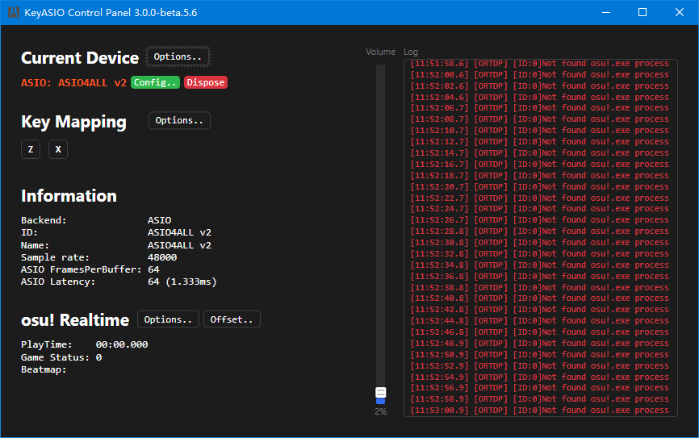
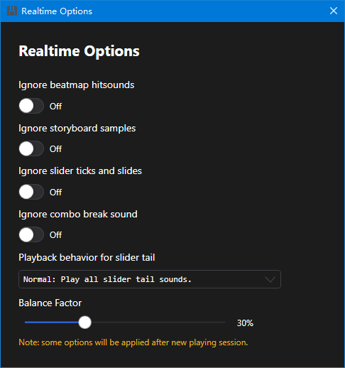

# KeyASIO.Net
External ASIO/WASAPI_EXCLUSIVE backend for low-latency and safe osu! audio playback experience.

While osu's original audio system has a latency for about 40 ms, this program can provide extremely low latency to as low as 0.6ms *(Verified by [EmertxE](https://osu.ppy.sh/users/954557), determine by your devices, from tapping to hearing)*, and for most players the latency can be lower than about 8-15ms *(with no professional soundcard, from tapping to hearing)*.

## Introduction
We have been waiting for the [very near future](https://osu.ppy.sh/community/forums/topics/428222?n=13) for several years, but it looks like that the dev team has been stopped supporting such heavy development for legacy osu. So there are many nice external community audio tools before like [REAL](https://github.com/miniant-git/REAL), [osu-External-ASIO-Sound](https://github.com/XTXTMTXTX/osu-External-ASIO-Sound), [AsioHookForOsu](https://github.com/zzhouhe/AsioHookForOsu), etc. But:
* Even with REAL, the osu's playback latency is still about 25ms. Anyway this is the easiest way to gain such improvement.
* Tools like osu-External-ASIO-Sound or AsioHookForOsu gives ASIO support, but they have some inevitable problems: 1. Inject and hook which is unsafe for your account. 2. Not perfect for custom hitsound support.

This project born to resolve these problems. As default, this program enables `RealtimeMode` in the configuration, which will use [OsuRTDataProvider](https://github.com/OsuSync/OsuRTDataProvider) to read osu's memory without modifying. The OsuRTDataProvider is commonly used for broadcasting tools (like [RTPP Displayer](https://osu.ppy.sh/community/forums/topics/685031?n=1)), and it looks safe because it was [approved by peppy](https://i.ppy.sh/6c651103246da60f794606d63b8fc30c3aafd4fa/68747470733a2f2f692e696d6775722e636f6d2f767744337a64302e706e67). *But nothing will be guaranteed, so I should still say please do at your own risk.*

**Benifits of KeyASIO.Net**
1. Support extremely low-latency playback around 0.6ms (determine by your devices, from tapping to hearing).
2. Fully support for playing beatmap's custom hitsound including storyboard samples, and hitsound customization like: User skin, Ignore custom hitsound, Ignore samples, Ignore volumes, Ignore slidertails, etc.
3. Optimize mania as per-key sound, just like behaviors in the game.
4. Safe for your account, **but no guarantee**.
5. A easy-to-use user interface.

## Screenshots 

  
   
  Overview

  
   
  Realtime options

## Configuration
The KeyASIO.Net supports `FullMode`, which can also synchronize the music, that will completely replace osu's sounds. This will make you much easier to start, but it has irresolvable problems. For players who has only one soundcard, you can try the fullmode. Otherwise, I only suggest with this option off.
### Without standalone soundcard 
#### FullMode ENABLED
> **Prerequisites**
> * Install [ASIO4ALL](https://www.asio4all.org/) / Just use WASAPI_EXCLUSIVE
> * Install [VB-CABLE](https://vb-audio.com/Cable/)

1. Change the device in the software GUI, select ASIO4ALL or your default WASAPI device with exclusive, and confirm.
2. If the ASIO4ALL is selected, open ASIO control panel and select your output device with others deselected. Press `Advanced Options` and adjust the options to lower the latency (Check latency at the software GUI)
3. Check your osu game to test whether the game has lags or problems to play. If yes, select the game's output to `VB-CABLE Input`
4. Enjoy

#### FullMode DISABLED
> **Prerequisites**
> * Make sure you have at least 2 audio output devices (including HDMI Audio). An HDMI decoder with audio port is required if your monitor doesn't have audio port.
> * A standalone mixer. Low-end device is just ok, since they are always very cheap. **DO NOT USE WINDOWS MIXER SOFTWARES**, since they will only increase the latency.
> * Install [ASIO4ALL](https://www.asio4all.org/) / Just use WASAPI_EXCLUSIVE

1. Use HDMI output to display monitor or HDMI decoder, and line-out to the mixer. Line-out your motherboard soundcard to the mixer. Plug your headphone into the mixer.
2. Change the device in the software GUI, select ASIO4ALL and confirm.
3. Open the ASIO4ALL control panel, and select something like `HDMI Out` with others deselected. Press `Advanced Options` and adjust the options to lower the latency (Check latency at the software GUI)
4. Select your motherboard device in osu game. Please do not select the same device as ASIO4ALL. It doesn't work.
5. Change your own key bindings in the software GUI.
6. Set the effect volume to 0 in osu!.
7. Open offset wizard, play with `Auto` mod and adjust the software's offset and osu!'s offset.
8. Enjoy

### With standalone soundcard 
#### FullMode ENABLED
Same as [Without standalone soundcard](#without-standalone-soundcard)

#### FullMode DISABLED
> **Prerequisites**
> * Check if your soundcard has original ASIO driver. If no, install [ASIO4ALL](https://www.asio4all.org/) / just use WASAPI_EXCLUSIVE
> * If your soundcard driver doesn't support ASIO concurrency, a standalone mixer is needed. Low-end device is just ok, since they are always very cheap. **DO NOT USE WINDOWS MIXER SOFTWARES**, since they will only increase the latency.

1. Change the device in the software GUI, and select your ASIO Device.
2. Change options in your ASIO control panel to lower the latency (Check latency at the software GUI).
3. If you use mixer, line-out your motherboard soundcard and soundcard to the mixer. Plug your headphone into the mixer.
4. Select the fit device in osu game. Select motherboard if you use mixer, select your soundcard otherwise.
5. Change your own key bindings in the software GUI.
6. Set the effect volume to 0 in osu!.
7. Open offset wizard, play with `Auto` mod and adjust the software's offset and osu!'s offset.
8. Enjoy

**Full options in `appsettings.yaml`:** (Modify after program closed) 
| Item                                    | Description                                                                                                                                                                  |
| --------------------------------------- | :--------------------------------------------------------------------------------------------------------------------------------------------------------------------------- |
| Debugging                               | Show debug logs.                                                                                                                                                             |
| Device                                  | Device configuration (Recommend to configure in GUI).                                                                                                                        |
| HitsoundPath                            | Default hitsound path (relative or absolute) for playing.                                                                                                                    |
| Keys                                    | Triggering keys. See https://docs.microsoft.com/en-us/dotnet/api/system.windows.forms.keys?view=windowsdesktop-6.0 for more inforamtion.                                     |
| RealtimeMode                            | If true, the software will enable memory scanning and play the right hitsounds of beatmaps.                                                                                  |
| RealtimeMode.AudioOffset                 | The offset when `RealtimeMode` is true (allow adjusting in GUI).                                                                                                             |
| RealtimeMode.BalanceFactor              | Balance factor.                                                                                                                                                              |
| RealtimeMode.IgnoreBeatmapHitsound      | Ignore beatmap's hitsound and force using user skin instead.                                                                                                                 |
| RealtimeMode.IgnoreComboBreak           | Ignore combo break sound.                                                                                                                                                    |
| RealtimeMode.IgnoreSliderTicksAndSlides | Ignore slider's ticks and slides.                                                                                                                                            |
| RealtimeMode.IgnoreStoryboardSamples    | Ignore beatmap's storyboard samples.                                                                                                                                         |
| RealtimeMode.SliderTailPlaybackBehavior | Slider tail's playback behavior. Normal: Force to play slider tail's sounds; KeepReverse: Play only if a slider with multiple reverses; Ignore: Ignore slider tail's sounds. |
| SampleRate                              | Device's sample rate (allow adjusting in GUI).                                                                                                                               |
| SkinFolder                              | The skin folder when `RealtimeMode` is true.                                                                                                                                 |
| VolumeEnabled                           | Software volume control. Disable for extremely low latency when `RealtimeMode` is false                                                                                      |
| Volume                                  | Configured device volume.                                                                                                                                                    |
## FAQs

#### How to change skins?
Please change it in configuration file.

#### How to report bugs?
If you're sure it's a bug and have steps to reproduce, please open Github issue. For any other problems please reply in the forum page or Github's discussion page.

## Todo
- [ ] Sometimes the hit is muted. (headache thing)
- [ ] Nightcore beats
- [ ] Try to sync with the music, and be able to mute completely in osu.
