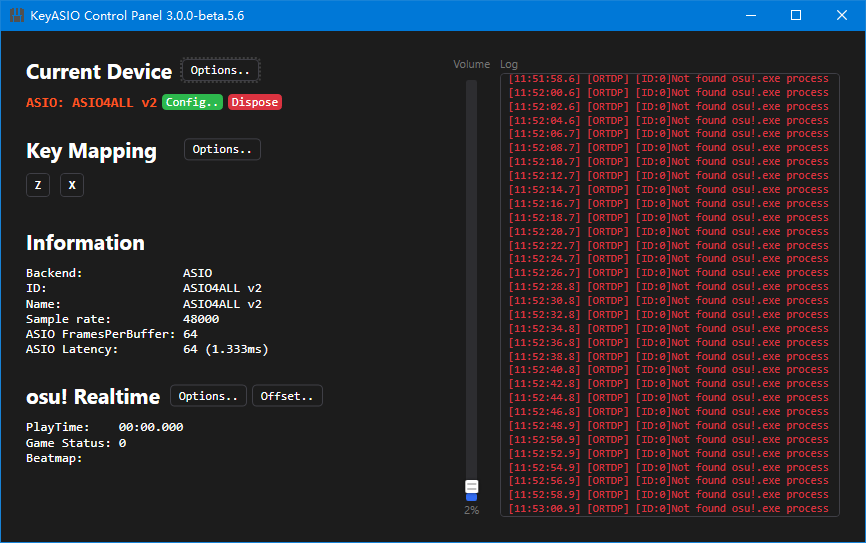
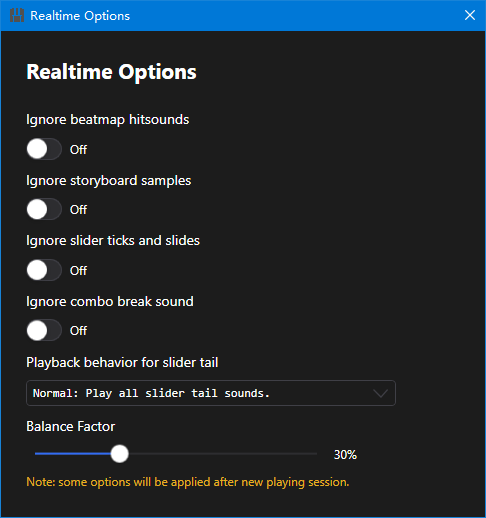

<div align="center">

<!--[](link)
Join our [Discord](YOUR_DISCORD_LINK) for early access and updates.-->
# ⚡ KeyASIO.Net
**Low-Latency Audio Middleware for osu!**

[](https://github.com/Milkitic/KeyASIO.Net/releases/latest)
[](https://github.com/Milkitic/KeyASIO.Net)
[](LICENSE)
[](https://deepwiki.com/Milkitic/KeyASIO.Net)

<p align="center">
  <b>Audio latency as low as 0.6ms.</b><br>
  <i>"I was hearing clicks before I even tapped." — player feedback</i>
</p>

</div>

---

## 🚀 Why KeyASIO?

osu!'s built-in audio stack typically sits around 30–40ms of latency. KeyASIO replaces it with an external
**ASIO / WASAPI Exclusive** backend that talks past the Windows mixer, and reconstructs hitsounds in real time
from the game's own memory.

- **⚡ Low latency:** ~0.6ms on high-end hardware (verified by [EmertxE](https://osu.ppy.sh/users/954557)),
  8–15ms on generic setups.
- **🎮 Real game integration:** reads game state via `ReadProcessMemory` (stable) or a named-pipe IPC bridge
  (lazer). It's not "press a key, play a sound" — it's synchronized to the live beatmap and judgement state.
- **🎧 Full hitsound support:** custom hitsounds, storyboard samples, dynamic volume, skin overrides.
- **🎹 Mania-aware:** per-key sound processing matching the native game's behavior.

## 📸 Screenshots

<p align="center">
  
  
</p>

---

## ⚙️ Configuration Guide

KeyASIO has two main modes. Pick the one that matches your hardware.

### 🚩 Which mode should I choose?

- **I have a dedicated soundcard / audio interface / mixer:** → **Hardware Mix (Recommended)**.
  Lowest latency, needs hardware setup.
- **I'm on a laptop / integrated audio / no mixer:** → **Software Mix (FullMode)**.
  Easier setup, requires [VB-CABLE](https://vb-audio.com/Cable/).

<details>
<summary><h3>🔧 Option A: Hardware Mix (FullMode DISABLED) — Recommended</h3></summary>

**For:** users with more than one audio output (e.g. PC Line-out + dedicated soundcard) and a physical mixer.

1. **Prerequisites**
   - Your soundcard's ASIO driver, or [ASIO4ALL](https://www.asio4all.org/).
   - A physical mixer to combine osu! (music) and KeyASIO (hitsounds).
2. **Routing**
   - osu! music → `Device A` (e.g. motherboard Line-out).
   - KeyASIO hitsounds → `Device B` (e.g. external soundcard).
   - Mix A + B → headphones.
3. **In KeyASIO**
   - Select your ASIO device.
   - Set **Realtime Mode** to `TRUE`.
   - Set **FullMode (EnableMusicFunctions)** to `FALSE`.
4. **In osu!**
   - Set `Effect Volume` to 0.
   - Adjust your audio offset (likely below -40ms) to sync.

</details>

<details>
<summary><h3>💻 Option B: Software Mix (FullMode ENABLED)</h3></summary>

**For:** users with a single soundcard (laptops / desktops without a mixer).

1. **Prerequisites**
   - Install [VB-CABLE](https://vb-audio.com/Cable/).
2. **Routing**
   - Set osu!'s output to `VB-Cable Input`.
   - (Optional) If you stream, capture `VB-Cable Output` in OBS.
3. **In KeyASIO**
   - Select your real output device (headphones/speakers) with **WASAPI Exclusive** on.
   - Set **FullMode (EnableMusicFunctions)** to `TRUE`.
   - This mode fully replaces osu!'s audio engine.

</details>

---

**Full options in `appsettings.yaml`** (edit after the program is closed):

| Item | Description |
| --- | :-- |
| Debugging | Show debug logs. |
| Device | Device configuration (prefer configuring in the GUI). |
| HitsoundPath | Default hitsound path (relative or absolute). |
| Keys | Triggering keys. See [System.Windows.Forms.Keys](https://learn.microsoft.com/dotnet/api/system.windows.forms.keys). |
| RealtimeMode | When true, memory scanning is enabled and hitsounds are played from the loaded beatmap. |
| RealtimeMode.AudioOffset | Offset applied when `RealtimeMode` is on (adjustable in GUI). |
| RealtimeMode.BalanceFactor | Balance factor. |
| RealtimeMode.IgnoreBeatmapHitsound | Ignore the beatmap's hitsounds and force the user skin. |
| RealtimeMode.IgnoreComboBreak | Suppress the combo-break sound. |
| RealtimeMode.IgnoreSliderTicksAndSlides | Ignore slider ticks and slides. |
| RealtimeMode.IgnoreStoryboardSamples | Ignore the beatmap's storyboard samples. |
| RealtimeMode.SliderTailPlaybackBehavior | Slider-tail playback. `Normal`: always play; `KeepReverse`: only on multi-reverse sliders; `Ignore`: never play. |
| SampleRate | Device sample rate (adjustable in GUI). |
| SkinFolder | Skin folder used when `RealtimeMode` is on. |
| VolumeEnabled | Software volume control. Disable for lowest latency when `RealtimeMode` is off. |
| Volume | Configured device volume. |

## ❓ FAQ

<details>
<summary><b>Is this safe for my osu! account?</b></summary>
KeyASIO reads game state passively (like tosu, StreamCompanion or Gosumemory), an approach that has been accepted for similar tools. As always, <b>use at your own risk</b>.
</details>

<details>
<summary><b>Why do I hear no sound in Auto mod?</b></summary>
In Exclusive mode osu! can lose control of the audio device and its internal clock desyncs — this is expected when bypassing the Windows Mixer. Select a different audio device in osu!.
</details>

---

## 🛠️ For Developers

This section is for anyone who wants to build KeyASIO locally, write a plugin, or understand the internals.
The user-facing sections above are all most people need; the rest is optional.

### Build

- **.NET 10 SDK** (net10.0, x64). The solution file is `KeyAsio.Net.slnx`.
- Package versions are centralized in `Directory.Packages.props`.
- Some dependencies are vendored as projects under `dependencies/` (a trimmed `NAudio.Asio`,
  `Milki.Extensions.*`, and `OverlayAPI.LazerProtocol` for lazer IPC).
- Native AOT is supported via the `Satori.targets` import; assembly signing runs through `Signer.ps1`
  when a private key is present.
- SIMD benchmarks live in `benchmarks/SimdBenchmarks/` (BenchmarkDotNet).

```
dotnet build -c Release
dotnet run --project src/Apps/KeyAsio -c Release
```

### Solution layout

```
src/
  Apps/KeyAsio/                 Avalonia + Suki GUI, OS integration, DI composition root
  Common/
    KeyAsio.Application/        Plugin host, skin discovery, localization, session adapters
    KeyAsio.Configuration/      appsettings.yaml, migration, self-documenting YAML comments
    KeyAsio.Plugins.Contracts/  The only API surface plugins compile against (trimmable)
    KeyAsio.Plugins.Abstractions/
    KeyAsio.Common/             Implementation-independent utilities
    KeyAsio.Shared/
    KeyAsio.Sentry/              Crash reporting glue
    KeyAsio.Secrets/
  Core/
    KeyAsio.Core.Audio/         ASIO/WASAPI/DirectSound engine, mixing, caching, limiters
    KeyAsio.Core.Memory/        Process memory scanning, signature patterns, declarative reader
    KeyAsio.Core.OsuAudio/      Beatmap hitsound analysis, timeline, nightcore beat synthesis
    KeyAsio.Core.OsuPlayback/
    KeyAsio.Sync/               Game-state acquisition, state machine, hitsound sequencing
```

Dependency direction is inward, toward contracts and primitives. `KeyAsio.Sync` does not depend on
`KeyAsio.Application`; neither plugin contracts nor application services depend on Avalonia/Suki. See
[`docs/architecture.md`](docs/architecture.md) for the full boundary rules and the plugin contract
migration table.

### How it works

**Game state acquisition.** Two sources implement `IGameSyncSource` and are selected by priority:

- `StableMemoryGameSyncSource` opens the osu! process with `PROCESS_VM_READ` and resolves pointers
  declaratively from `osu_memory_rules.json` (signatures → pointer chains → typed values). Reads run on
  two cadences: timing data at ~2ms (500Hz), general data (mods, beatmap, combo, username) at ~50ms.
  The reader is single-threaded (`LongRunning`) to avoid pool switching; `timeBeginPeriod(1)` raises
  timer resolution and power throttling is disabled on the reader thread.
- `LazerIpcGameSyncSource` talks to lazer over two named pipes (timing + events) using the OverlayAPI
  delta protocol, and resolves beatmap files from lazer's hash-based store.

Both feed `SyncSessionContext`, which mirrors the game state and computes a **predicted, monotonic
PlayTime** anchored on the last memory read and extrapolated by the playback rate (1.5× for DT/Nightcore,
0.75× for HT). Backward motion is classified as a seek (>100ms) or a freeze (<100ms), so the 2ms read
jitter never reaches the audio engine.

**Sync loop.** `SyncController` runs a `LongRunning` 500Hz loop driven by `Stopwatch`. Each tick dispatches
into a `GameStateMachine` (`Playing` / `Browsing` / `Results` / `NotRunning`). `PlayingState` runs
hitsound sync at up to 1000Hz, drives the autoplay/manual playback queues, and handles slider-loop
pause/resume on `IsAudioPaused` edges.

**Hitsound sequencing.** Per-ruleset sequencers (`Standard` / `Taiko` / `Mania` / `Catch`) implement
`IHitsoundSequencer`. `BeatmapHitsoundLoader` parses the `.osu` with `Coosu.Beatmap`, builds a timeline
of `SampleEvent` (one-shot) and `ControlEvent` (loop / volume / balance), and maintains a **13-second
sliding precache window** so sounds are decoded before they're needed. Playback is dispatched through
`SfxPlaybackService` into the effect mixer.

**Audio engine.** `AudioEngine` owns a dedicated STA thread (`AboveNormal` priority) for all device
calls. The mixer graph is:

```
EffectMixer ──┐
              ├─→ RootMixer (QueueMixingSampleProvider) ─→ Volume ─→ Limiter ─→ output device
MusicMixer  ──┘
```

- **Backends:** ASIO (vendored `NAudio.Asio`), WASAPI (exclusive or shared, event-driven), DirectSound.
- **Caching:** audio is decoded once to 16-bit PCM in native memory (`UnmanagedByteMemoryOwner`),
  keyed by a Blake3 hash of the file content, and converted to float on playback via tiered SIMD
  (`SimdAudioConverter`: AVX-512 → AVX2 → `Vector<short>` → scalar).
- **Hot path:** `QueueMixingSampleProvider` mixes with `TensorPrimitives.Add` (SIMD), queues
  add/remove operations, and recycles finished sources into a shared pool. No allocations on the
  audio thread beyond pool rentals.
- **Rate / pitch:** `PlaybackTimelineClock` applies rate scaling with pitch-preservation position
  compensation; `IPlaybackRateProcessor` is the time-stretch extension point.
- **Limiters:** selectable per config — peak, soft (polynomial), hard, or off.

### Plugin system

Plugins compile only against `KeyAsio.Plugins.Contracts` and must **not** reference the host,
`Sync`, `Configuration`, or Avalonia/Suki. The host loads each plugin into a collectible
`AssemblyLoadContext`, shares the contracts assembly with the default context (so types stay
identity-equal), and resolves plugin-private dependencies beside the plugin DLL.

Key contract interfaces:

| Interface | Purpose |
| --- | --- |
| `IPlugin` / `ISyncPlugin` | Lifecycle (`Startup`/`Shutdown`/`Unload`) and sync callbacks (`OnTick`, `OnStatusChanged`, `OnBeatmapChanged`). |
| `IPluginContext` | `LoggerFactory`, `IAudioEngine`, `IPluginSettings`, `IGameplaySession`, `IPluginInteractionService`. |
| `ISyncContext` | Read-only game-state view: `PlayTime`, `PlayMods`, `OsuStatus`, `Statistics`, `HitErrors`, `Beatmap`. |
| `IGameStateHandler` | Per-status handler with `Priority` and a `HandleResult` that can block lower-priority handlers or the base logic. |
| `IAudioEngine` | Narrow audio port: open files, add/remove music inputs, acquire seekable sample providers. |
| `IGameplaySession` | Resolve beatmap resources, create cached audio providers. |

`SyncPluginCoordinator` adapts `SyncSessionContext` to `ISyncContext` and dispatches handler calls by
priority; `HandleResult.BlockLowerPriority` / `BlockBaseLogic` lets a plugin override or suppress the
built-in sync logic.

### Configuration

`appsettings.yaml` (YamlDotNet, camelCase) is self-documenting — `[Description]` attributes are emitted
as YAML comments on save. Legacy configs are auto-migrated, including enum renames
(`MidSide → ProMixFocus`, `BinauralMix → LinearStereoPan`, `CrossMix → ConstantPower`,
`Polynomial → Soft`, `Master → Peak`). Top-level sections: `General`, `Input`, `Paths`, `Audio`,
`Logging`, `Performance`, `Sync`, `Update`.

Notable knobs: `Sync.Scanning.{General,Timing}ScanInterval`, `Sync.Playback.{NightcoreBeats,
LimiterType, BalanceMode}`, `Sync.Filters.{DisableBeatmapHitsounds, DisableStoryboardSamples,
DisableSliderTicksAndSlides}`, `Performance.EnableAvx512`, `Update.Channel` (Stable/Beta).

## 🚧 Roadmap (v4 Preview)

A complete rewrite (**KeyASIO v4**) is in progress. Per-version changelogs live in
[`docs/Updates/`](docs/Updates).

---

<p align="center">
  Made for the osu! community.
</p>